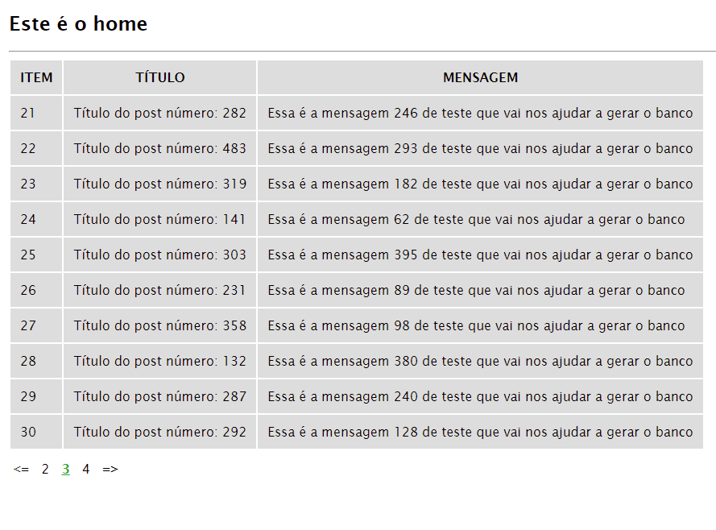

## Sistema de paginação

Captura o parâmetro 'p' via get passado pela ulr, assim a lógica divide o número de resultados pela quantia limite de ocorrências repassando para a próxima consulta.

## Conexão com a base de dados

Inserir os dados de configuração no arquivo:
	* config.php

## Base URL

Inserir a url base até a pasta public no arquivo:
	* config.php

## Views

Foi parametrizado apenas 2 views no projeto, uma para erro 404 e outra para listagem.

## Estrutura

A arquitetura utilizada no sistema é um mvc simples.

